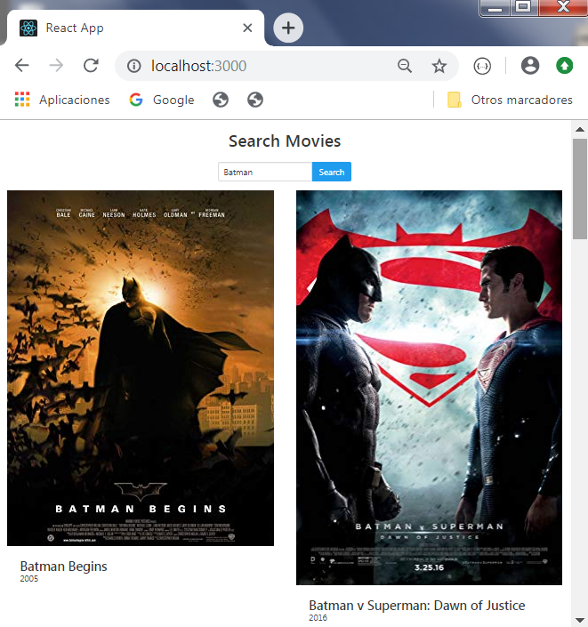

# Nombre Proyecto : BuscadorPeliculas-React

------------------------------------------------------------------------------
## Funcionalidades del proyecto

Las funcionalidades más importantes del proyecto son :
  * Buscar y listar películas
  * Ver detalle de cada película

Url del sitio web : http://alejandro-search-movies.surge.sh/

------------------------------------------------------------------------------
### Lenguajes , Frameworks

* El proyecto está desarrollado con <b>React</b> en conjunto con <b>JS</b> .
* Como framework de diseño se implemento <b>Bulma</b>
* Nos conectamos a la <b>api OMDB</b>, que nos permite obtener información de una o varias películas filtrandolas por dicho título
* Utilizamos <b>Surge</b>(un servicio que nos permite publicar una web estática) para subir nuesta aplicación a internet

------------------------------------------------------------------------------

### Imagenes del proyecto

* 1) Página de Inicio

    

* 2) Búsqueda Obtenida

    

* 3) Detalle de búsqueda obtenida

    

* 4) Página de pelicula no encontrada

    

